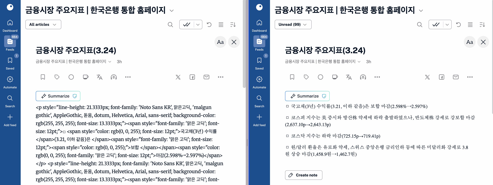
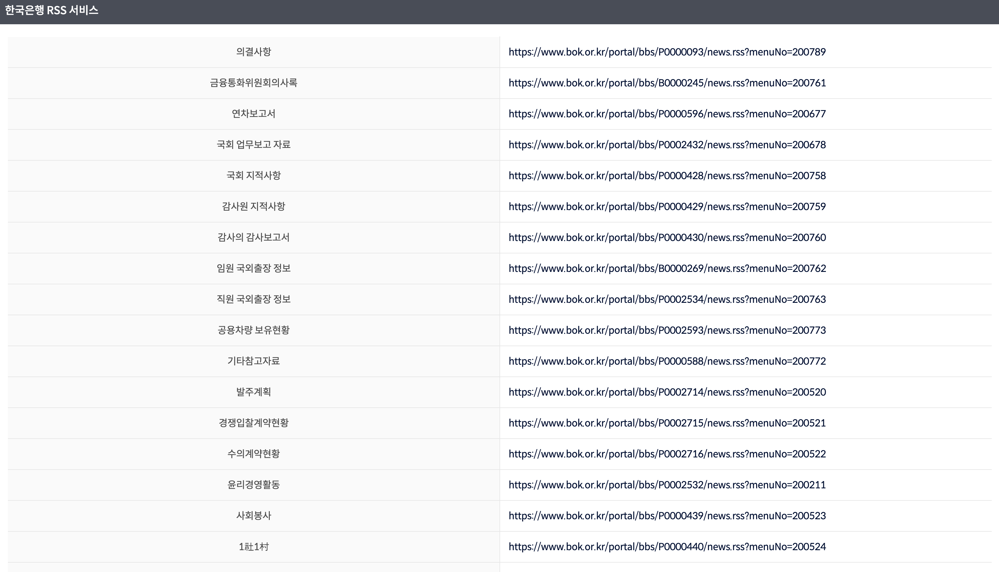

# bok-rss-relay

bok-rss-relay는 [한국은행]에서 제공하는 RSS 내용을 정상적으로 읽을 수 있도록 수정하여 제공하는 릴레이 서버 프로그램입니다.

원래는 `https://www.bok.or.kr/portal/bbs/<id>/news.rss?menuNo=<menuNo>` 와 같은 꼴로 되어있는데 `https://<hostname>/rss/<id>?menuNo=<menuNo>` 로 넘겨 사용할 수 있습니다.

이미 배포해놓은 것을 사용하려면 `https://bok-rss-relay.fly.dev/rss/<id>?menuNo=<menuNo>` 를 사용하시면 됩니다.

원본 RSS와 릴레이 RSS 비교 스크린샷:


## 개발

아래 명령어로 실행할 수 있습니다. 현재 기본적으로 3000 포트로만 열립니다.

```
cargo run
```

테스트는 아래 명령어로 실행할 수 있습니다.

```
cargo test
```

## 배경

[한국은행](Bank of Korea, bok)은 한국은행 사이트에 올라오는 자료들을 RSS 방식으로 구독할 수 있도록 기능을 제공합니다. ([RSS 목록](https://www.bok.or.kr/static/guide/portal/popup/rss_popup.html))



[한국은행]: https://www.bok.or.kr/portal/main/main.do
